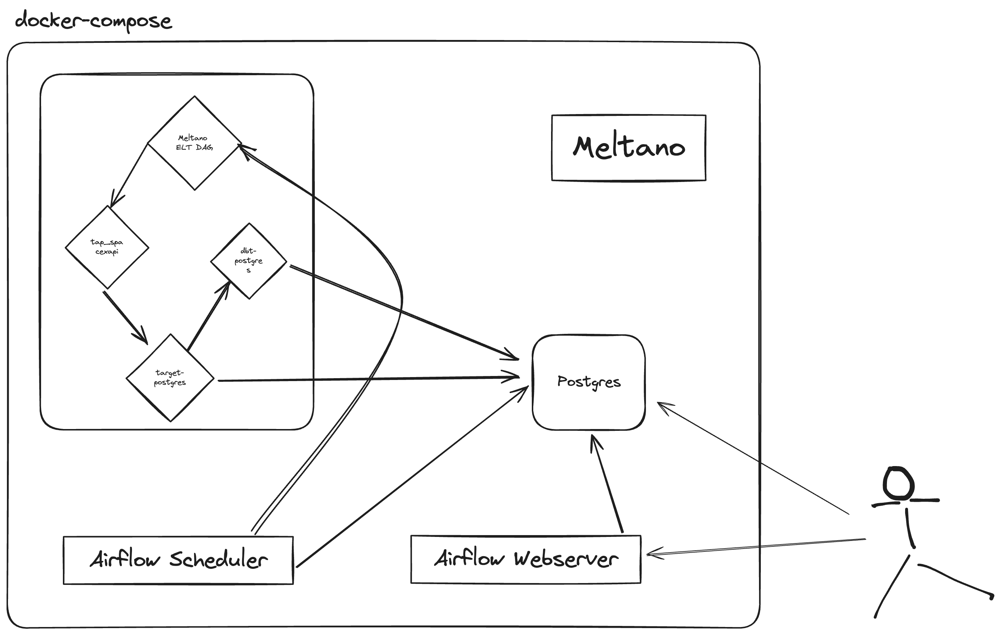

# Starlink Analytics with Meltano

## Goal

The goal of this exercise is for you to implement a fully functional end-to-end ETL pipeline via the open-source, 
full-stack data integration platform [Meltano](https://meltano.com/).

Data is provided by the [SpaceX API](https://github.com/r-spacex/SpaceX-API/tree/master), and
as it should be with any good data challenge, this work will be guided by one central question that we are aiming to
help find an answer for:

> When will there be 42,000 Starlink satellites in orbit, and how many launches will it take to get there?


## Implementation Details

### Architecture

<br />

<p align="center">
  
</p>

#### Current Implementation Details
- docker-compose for orchestration
- Postgres DBs to store Airflow metadata and 
- Meltano tap as custom extractor to get data from SpaceXAPI
- Meltano loader to load API data to Postgres
- Meltano dbt transformer to model data in Postgres

#### What can be improved
- Kubernetes could replace docker-compose for more production grade setup
- Meltano's already existing tap for SpaceX-API could be used instead of custom tap
- Setup up some visualisation tool connected to the Data i.e. Metabase/Superset etc
- Improve transformation logic as dbt logic is just a proof-of-working-concept

### Requirements
Below tooling should be installed before moving on to next steps
- [Docker](https://docs.docker.com)
- [docker-compose](https://docs.docker.com/compose/)

### Running the project
- Run below command to create and start containers
```bash
$ make up
```

Above will start containers including Postgres, Airflow Webserver/Scheduler.

### Trigger the ELT
- Open `localhost:8080` with user:password as `airflow:airflow`
- Enable and trigger the DAG named `meltano_spacexapi_daily` to download the data, load to postgres data base and transform the data to the answer to the question.
- Run below command to query the answer to the question
```bash
make query_data
```

```
-[ RECORD 1 ]------------------+-----------------------------
total_launches                 | 61
total_satellites               | 3048
remaining_satellites           | 38952
remaining_launches             | 780
remaining_launches_target_date | 2064-07-09
transformation_updated_at      | 2023-12-12 08:00:00.608567
```

> Assumption: To calculate the date when total 42000 Starlink Satellites will be launched, the next launch is expected to start today (the day when transformation job runs). This can be improved later after discussing the requirements and assumptions from the stakeholders/domain-knowledge-experts.

### Stopping the project
- Run below command to stop and remove containers/networks
```bash
$ make down
```

## Useful Resources

* [Meltano Official Website](https://meltano.com/)
* [Meltano Docs](https://docs.meltano.com/)
* [Meltano Tutorial: Create a Custom Extractor](https://docs.meltano.com/tutorials/custom-extractor)
* [Meltano target-postgres Docs](https://hub.meltano.com/loaders/target-postgres/)
* [SpaceX-API Docs](https://github.com/r-spacex/SpaceX-API/blob/master/docs/README.md)
* [dbt Docs](https://docs.getdbt.com/)